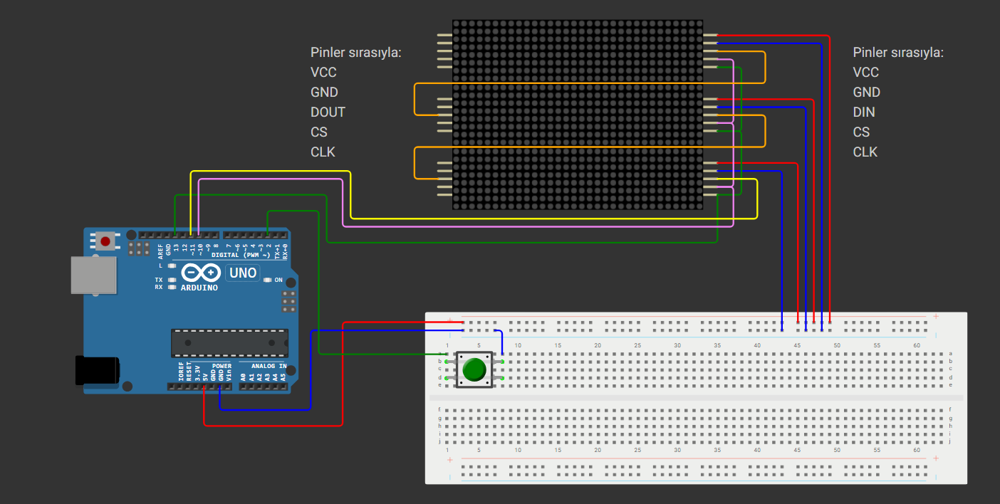

# 🎮 Arduino Tower Game (Stacker)

Arduino Uno ve LED matris modülleri kullanılarak geliştirilmiş, klasik **Stacker** (Kule Dizme) oyununun modern ve dikey versiyonu.



## 📖 Proje Hakkında

Bu proje, klasik atari salonu oyunu olan "Stacker"ın Arduino ve LED matris modülleri kullanılarak geliştirilmiş interaktif bir versiyonudur. Projenin temel amacı, refleks ve zamanlama yeteneğini kullanarak hareket eden ışık bloklarını üst üste hatasız bir şekilde dizmek ve kulenin en tepesine ulaşmaktır.

## ✨ Özellikler

- **Dinamik Oynanış**: Oyun 5 piksel genişliğinde bir blokla başlar ve her seviyede blok boyutu küçülebilir
- **Otomatik Zorluk Artışı**: Kule yükseldikçe blokların hareket hızı otomatik olarak artar
- **Hassas Buton Kontrolü**: Milisaniyelik tepkime süresi için optimize edilmiş buton algılama
- **Görsel Efektler**: Kazanma ve kaybetme animasyonları
- **Kompakt Tasarım**: Breadboard üzerinde tam fonksiyonel çalışma

## 🔧 Donanım Gereksinimleri

- **Arduino Uno** (1 adet)
- **MAX7219 8x8 Dot Matrix LED Modül** (3 adet)
- **Push Button** (1 adet)
- **Breadboard ve Jumper Kablolar**
- **5V Güç Kaynağı** (Arduino USB veya harici)

### Donanım Yapısı

Projede 3 adet MAX7219 8x8 LED matris modülü dikey (portrait) olarak konumlandırılarak **8x24 piksellik** uzun bir oyun kulesi oluşturulmuştur.

**Bağlantı Mimarisi:**
- **Güç ve Saat Sinyalleri**: Tüm modüllere paralel (Bus/Ortak Hat yöntemi)
  - 5V ve GND → Tüm modüllere ortak
  - CLK (Clock) → Tüm modüllere ortak
  - CS (Chip Select) → Tüm modüllere ortak
- **Veri Sinyali**: Seri zincir (Daisy Chain yöntemi)
  - DIN → DOUT şeklinde modülden modüle aktarılır

## 📦 Kurulum

### 1. Kütüphane Kurulumu

Projenin çalışması için **LedControl** kütüphanesinin Arduino IDE'ye yüklenmesi gerekmektedir:

1. Arduino IDE'yi açın
2. **Sketch** → **Include Library** → **Manage Libraries** menüsüne gidin
3. Arama kutusuna `LedControl` yazın
4. **LedControl by Eberhard Fahle** kütüphanesini bulun ve yükleyin

### 2. Devre Bağlantısı

Devre şemasına göre bağlantıları yapın:


### 3. Kod Yükleme

1. `sketch_nov26a/sketch_nov26a.ino` dosyasını Arduino IDE ile açın
2. Arduino Uno'yu bilgisayara bağlayın
3. Doğru port ve kartı seçin (**Tools** → **Board** → **Arduino Uno**)
4. **Upload** butonuna tıklayarak kodu yükleyin

## 🎯 Nasıl Oynanır

1. Oyun otomatik olarak başlar ve alt seviyeden itibaren ışık blokları sağa-sola hareket eder
2. Bloğu durdurmak için **butona basın**
3. Blok, alttaki katla hizalanmazsa taşan kısımlar kesilir ve blok küçülür
4. Her seviyede hareket hızı artar
5. Kulenin tepesine ulaştığınızda oyunu kazanırsınız!
6. Blok tamamen kaybolursa oyun biter

## 🛠️ Teknik Detaylar

### Yazılım Mimarisi

- **Kütüphane**: LedControl (by Eberhard Fahle)
- **Zamanlama**: `millis()` tabanlı non-blocking timer sistemi
- **Buton Algoritması**: 
  - **State Change Detection**: Durum değişikliği algılama
  - **Debounce**: Mekanik titreme önleme (ark önleme)
  - Standart `delay()` yerine milisaniye hassasiyetinde tepki süresi

### Performans Optimizasyonları

Projenin en kritik geliştirmesi **buton tepkime süresi** optimizasyonudur:
- Standart `delay()` komutları tamamen kaldırılmıştır
- Millis-based zamanlayıcılar ile non-blocking kod yapısı
- Debounce algoritması ile çift basma hatalarının önlenmesi
- Milisaniyelik hassasiyette tepki süresi

### Donanım Adaptasyonu

Başlangıçta 4 modül planlanmışken, yapılan testler ve donanım optimizasyonu sonucu proje **3 modüle** başarıyla uyarlanmıştır. Bu esneklik, projenin modüler yazılım mimarisi sayesinde mümkün olmuştur.

## 🏗️ Proje Yapısı

```
arduino-tower-game/
│
├── sketch_nov26a/
│   └── sketch_nov26a.ino    # Ana Arduino kodu
│
├── image/
│   └── circuit_diagram.png   # Devre şeması
│
└── README.md                 # Proje dokümantasyonu
```

## 🎓 Öğrenilen Kavramlar

- MAX7219 LED matris kontrolü
- SPI benzeri seri haberleşme (Daisy Chain)
- Non-blocking zamanlama teknikleri
- Debounce algoritmaları
- State machine pattern
- Gerçek zamanlı oyun geliştirme

## 🤝 Katkıda Bulunma

Bu proje eğitim amaçlı geliştirilmiştir. Geliştirmeler ve öneriler için Pull Request açabilirsiniz.

---

⭐ Projeyi beğendiyseniz yıldız vermeyi unutmayın!

